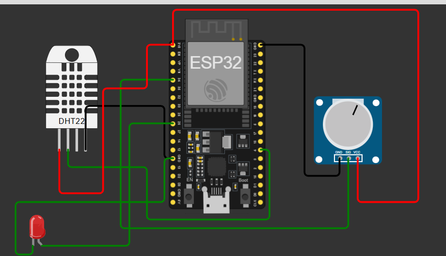
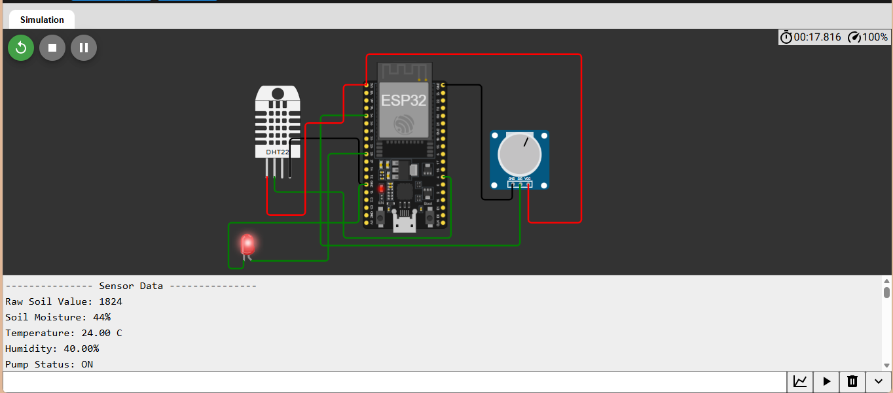
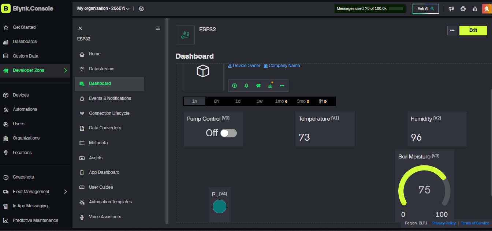

# 🌱 Smart Irrigation and Environmental Monitoring System using ESP32

## 🚀 Live Demo

### Wokwi Simulation

https://wokwi.com/projects/467195007656427521

Click **Run** to simulate the complete IoT Smart Irrigation System.

### GitHub Repository

https://github.com/eager-31/smart-irrigation-system-esp32

---

## 📖 Overview

The Smart Irrigation and Environmental Monitoring System is an IoT-based solution developed using ESP32, DHT22, MQTT, and Blynk Cloud.

The system continuously monitors soil moisture, temperature, and humidity in real time. Based on predefined thresholds and hysteresis logic, it automatically controls irrigation while also publishing sensor data to the cloud through MQTT and displaying live information on a Blynk dashboard.

This project demonstrates embedded systems, IoT communication, cloud connectivity, and remote monitoring capabilities.

---

## 🏗️ System Architecture

```text
DHT22 + Soil Moisture Sensor
            │
            ▼
          ESP32
            │
     WiFi Connectivity
            │
     ┌──────┴──────┐
     ▼             ▼
 MQTT Broker    Blynk Cloud
 (HiveMQ)          │
     │             ▼
     └──────► Mobile Dashboard
```

---

## ✨ Features

* Real-time Temperature Monitoring
* Real-time Humidity Monitoring
* Soil Moisture Monitoring
* Automatic Irrigation Control
* Hysteresis-Based Pump Logic
* MQTT Cloud Connectivity (HiveMQ)
* Blynk Mobile Dashboard Integration
* Remote Pump Monitoring
* Remote Pump Control
* WiFi Enabled IoT Communication
* Cloud Data Publishing
* Wokwi Simulation Support

---

## 📷 Screenshots

### Circuit Diagram



### Serial Monitor Output



### Blynk Dashboard



---

## 🧩 Components Used

| Component            | Description                            |
| -------------------- | -------------------------------------- |
| ESP32                | Main Microcontroller                   |
| DHT22                | Temperature and Humidity Sensor        |
| Soil Moisture Sensor | Simulated using Potentiometer in Wokwi |
| LED                  | Pump Status Indicator                  |
| HiveMQ Broker        | MQTT Cloud Communication               |
| Blynk Cloud          | Mobile Dashboard and Remote Control    |
| WiFi                 | Wireless Communication                 |

---

## ⚙️ System Workflow

```text
Start
  │
  ├── Read Soil Moisture
  ├── Read Temperature
  ├── Read Humidity
  │
  ├── Apply Hysteresis Logic
  │
  ├── Control Pump
  │
  ├── Publish Data to MQTT Broker
  │
  ├── Update Blynk Dashboard
  │
  └── Repeat
```

---

## 🔧 Working

1. ESP32 reads soil moisture values through ADC.
2. DHT22 provides temperature and humidity readings.
3. Hysteresis logic determines whether irrigation should be enabled or disabled.
4. Pump status is indicated through an LED.
5. Sensor data is displayed on the Serial Monitor.
6. Sensor values are published to an MQTT broker (HiveMQ).
7. Real-time data is displayed on the Blynk mobile dashboard.
8. Users can remotely monitor and control the system through the Blynk app.

---

## 🛠️ Technologies Used

* Embedded C++
* ESP32
* DHT22 Sensor
* ADC (Analog to Digital Conversion)
* MQTT Protocol
* HiveMQ Broker
* Blynk IoT Platform
* WiFi Communication
* Wokwi Simulation

---

## 📂 Project Structure

```text
smart-irrigation-system-esp32/
├── src/
│   └── smart_irrigation.ino
│
├── images/
│   ├── circuit_diagram.png
│   ├── output_image.png
│   ├── mqtt_output.png
│   └── blynk_dashboard.png
│
├── wokwi.toml
├── diagram.json
└── README.md
```

---

## 📊 MQTT Data Format

```json
{
  "soil_percent": 44,
  "temperature": 24.0,
  "humidity": 40.0,
  "pump_status": "ON"
}
```

---

## 🎯 Key Learning Outcomes

* ESP32 Programming
* Sensor Interfacing
* ADC Data Acquisition
* IoT System Design
* MQTT Publish/Subscribe Architecture
* Cloud-Based Monitoring
* Blynk Dashboard Integration
* Embedded Firmware Development

---

## 🔮 Future Improvements

* Cloud Data Logging using Firebase or ThingSpeak
* Mobile Push Notifications
* Relay-Controlled Water Pump
* Weather Forecast Integration
* AI-Based Irrigation Recommendations
* Historical Data Analytics Dashboard

---

## 👨‍💻 Author

**Deepak Birajee**

B.Tech, Electronics and Communication Engineering

IIIT Bhagalpur

GitHub: https://github.com/eager-31
